# Overall System Workflow

High-level architecture showing how all components connect.

```mermaid
flowchart TB
    subgraph Browser["Browser (React 19 + TypeScript)"]
        Login["Login Page"]
        AppShell["AppShell (3-Panel Layout)"]

        subgraph Panels["Resizable Panels"]
            Activity["Agent Activity Panel"]
            Dashboard["Dashboard Canvas"]
            Chat["Chat Panel"]
        end

        subgraph Stores["Zustand State Stores"]
            ChatStore["chatStore"]
            DashStore["dashboardStore"]
            AgentStore["agentStore"]
            SessionStore["sessionStore"]
            FilterStore["filterStore"]
        end
    end

    subgraph FastAPI["FastAPI Backend (Python)"]
        AuthRoutes["/auth/* Routes"]
        ChatRoute["/api/chat (SSE)"]
        LiveRoute["/api/agent/live (WebSocket)"]
        DatabricksRoutes["/databricks/* Routes"]
        BigQueryRoutes["/bigquery/* Routes"]
        WorkspaceRoutes["/workspace/* Routes"]
    end

    subgraph AgentLayer["AI Agent Layer"]
        LangGraph["LangGraph ReAct Agent"]
        ADKAgent["Google ADK Agent<br/>(Multimodal Live)"]
        Guardrail["Guardrail Node"]
        ToolNode["Tool Node"]
    end

    subgraph Tools["Agent Tools"]
        SearchMeta["search_metadata"]
        ExecSQL["execute_sql"]
        ExecBQ["execute_bigquery"]
        CreateViz["create_visualization"]
        CreateKPI["create_kpi_tile"]
        CreateTable["create_data_table"]
        ModifyDash["modify_dashboard"]
        RemoveTiles["remove_tiles"]
        CreateText["create_text_tile"]
        GetSchema["get_bigquery_schema"]
        GetTileData["get_tile_data"]
    end

    subgraph DataLayer["Data & Storage Layer"]
        Databricks["Databricks<br/>(SQL Warehouse / Spark)"]
        BigQuery["Google BigQuery"]
        Milvus["Milvus Vector DB<br/>(Schema Embeddings)"]
        SQLite["SQLite<br/>(Users, Sessions, Workspaces)"]
    end

    subgraph LLM["LLM Providers"]
        Gemini["Google Gemini<br/>(Vertex AI / API Key)"]
        OpenAI["OpenAI API"]
    end

    subgraph Auth["Authentication"]
        GoogleOAuth["Google OAuth 2.0"]
    end

    %% Browser to Backend
    Login -->|"OAuth redirect"| AuthRoutes
    AuthRoutes -->|"Cookie: session_token"| GoogleOAuth
    GoogleOAuth -->|"userinfo"| AuthRoutes
    AuthRoutes -->|"session + redirect"| Login

    Chat -->|"POST /api/chat (SSE)"| ChatRoute
    Chat -->|"WebSocket /api/agent/live"| LiveRoute

    ChatRoute --> LangGraph
    LiveRoute --> ADKAgent

    LangGraph --> Guardrail
    Guardrail -->|"IN_SCOPE"| ToolNode
    Guardrail -->|"OUT_OF_SCOPE"| ChatRoute

    ADKAgent --> ToolNode

    LangGraph --> Gemini
    LangGraph --> OpenAI
    ADKAgent --> Gemini

    ToolNode --> SearchMeta
    ToolNode --> ExecSQL
    ToolNode --> ExecBQ
    ToolNode --> CreateViz
    ToolNode --> CreateKPI
    ToolNode --> CreateTable
    ToolNode --> ModifyDash
    ToolNode --> RemoveTiles
    ToolNode --> CreateText
    ToolNode --> GetSchema
    ToolNode --> GetTileData

    SearchMeta --> Milvus
    ExecSQL --> Databricks
    ExecBQ --> BigQuery
    GetSchema --> BigQuery

    AuthRoutes --> SQLite
    WorkspaceRoutes --> SQLite

    %% SSE/WebSocket events back to frontend
    ChatRoute -->|"SSE events:<br/>visualization, data_table,<br/>kpi, agent_step, query"| ChatStore
    LiveRoute -->|"WebSocket events:<br/>tool results, voice audio"| ChatStore

    ChatStore -->|"callbacks"| DashStore
    DashStore --> Dashboard
    AgentStore --> Activity

    Dashboard -->|"Vega-Lite charts<br/>Data tables<br/>KPI cards<br/>Text tiles"| Panels
```

## Data Flow Summary

| Flow | Protocol | Direction |
|------|----------|-----------|
| Text chat | SSE (Server-Sent Events) | Frontend → Backend → Frontend (streaming) |
| Voice chat | WebSocket | Bidirectional real-time |
| Auth | HTTP redirect + cookies | Frontend ↔ Google ↔ Backend |
| Dashboard state | Zustand callbacks | Backend events → Store → React components |
| Data queries | SQL over HTTP | Backend → Databricks / BigQuery |
| Schema search | Vector similarity | Backend → Milvus |
| Persistence | SQLite | Backend → Local file DB |
