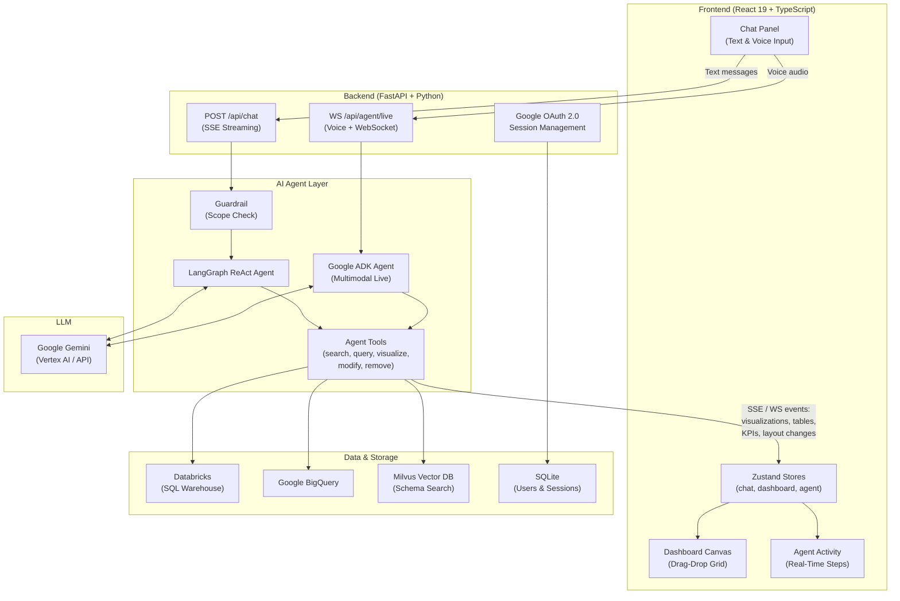

# Overall System Workflow

```mermaid
flowchart TB
    subgraph Browser["Frontend (React 19 + TypeScript)"]
        Chat["Chat Panel<br/>(Text & Voice Input)"]
        Dashboard["Dashboard Canvas<br/>(Drag-Drop Grid)"]
        Activity["Agent Activity<br/>(Real-Time Steps)"]
        Stores["Zustand Stores<br/>(chat, dashboard, agent)"]
    end

    subgraph Backend["Backend (FastAPI + Python)"]
        Auth["Google OAuth 2.0<br/>Session Management"]
        ChatAPI["POST /api/chat<br/>(SSE Streaming)"]
        LiveAPI["WS /api/agent/live<br/>(Voice + WebSocket)"]
    end

    subgraph Agent["AI Agent Layer"]
        Guardrail["Guardrail<br/>(Scope Check)"]
        LangGraph["LangGraph ReAct Agent"]
        ADK["Google ADK Agent<br/>(Multimodal Live)"]
        Tools["Agent Tools<br/>(search, query, visualize,<br/>modify, remove)"]
    end

    subgraph Data["Data & Storage"]
        Databricks["Databricks<br/>(SQL Warehouse)"]
        BigQuery["Google BigQuery"]
        Milvus["Milvus Vector DB<br/>(Schema Search)"]
        SQLite["SQLite<br/>(Users & Sessions)"]
    end

    subgraph LLM["LLM"]
        Gemini["Google Gemini<br/>(Vertex AI / API)"]
    end

    Chat -->|"Text messages"| ChatAPI
    Chat -->|"Voice audio"| LiveAPI
    ChatAPI --> Guardrail --> LangGraph --> Tools
    LiveAPI --> ADK --> Tools
    LangGraph <--> Gemini
    ADK <--> Gemini
    Tools --> Milvus
    Tools --> Databricks
    Tools --> BigQuery
    Auth --> SQLite

    Tools -->|"SSE / WS events:<br/>visualizations, tables,<br/>KPIs, layout changes"| Stores
    Stores --> Dashboard
    Stores --> Activity
```
