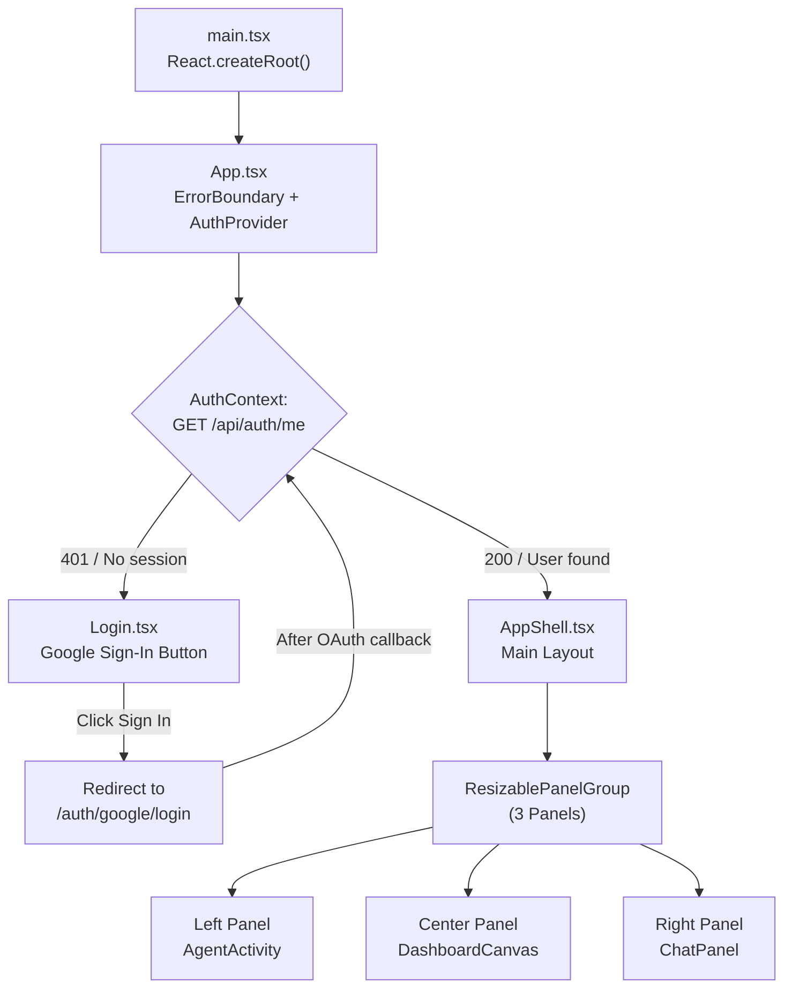
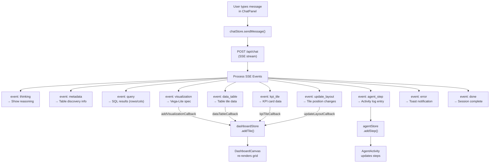
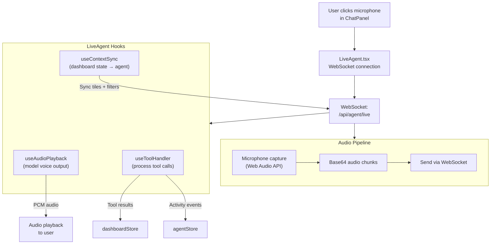
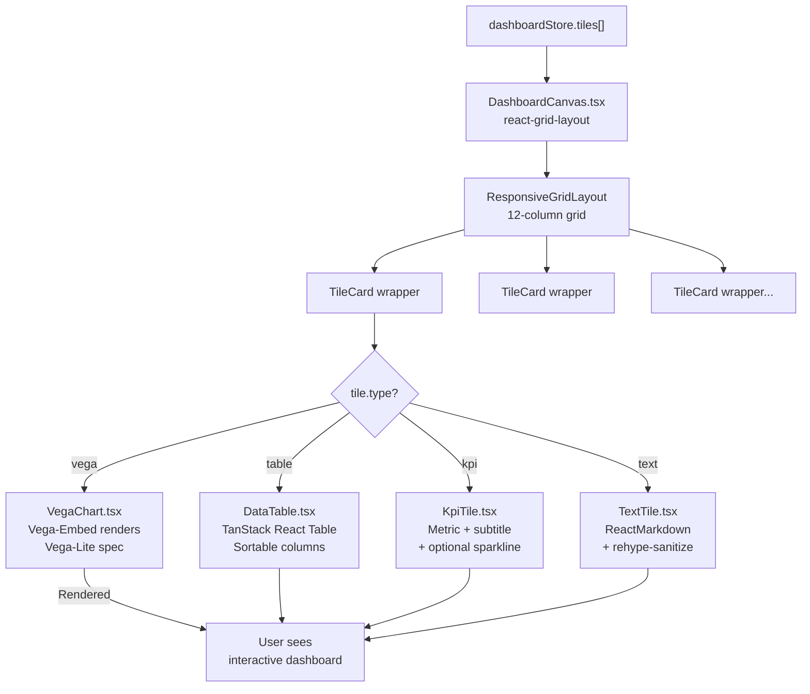
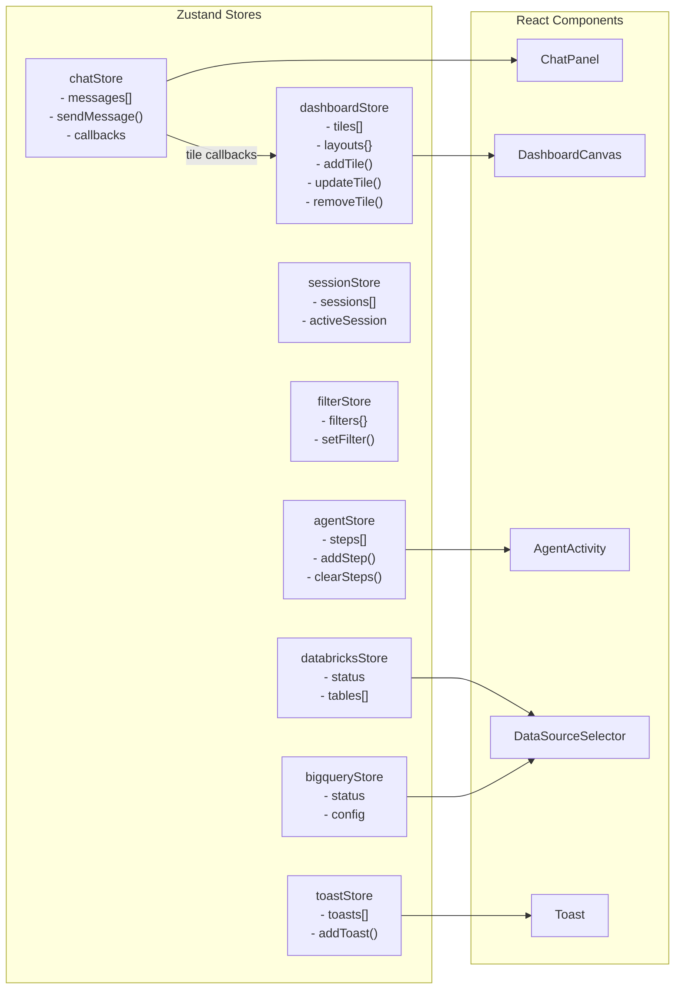

# Frontend Workflow

Detailed flow of the React frontend application.

## Application Initialization

## Chat Flow (Text Input)

## Chat Flow (Voice Input)

## Dashboard Rendering

## State Management Architecture

