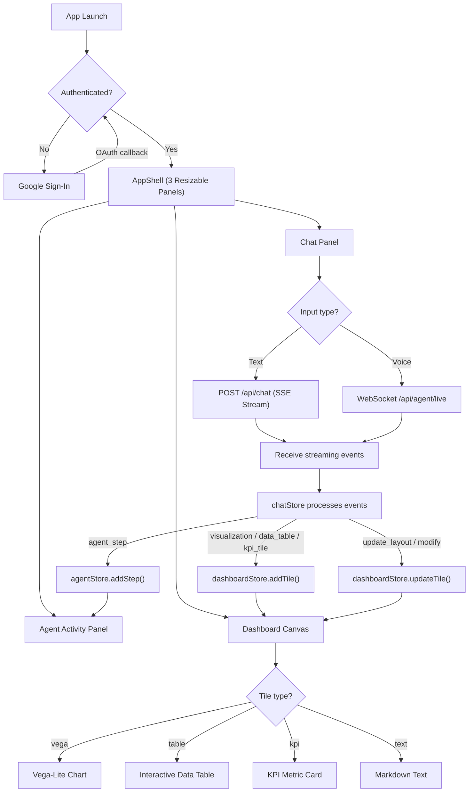

# Frontend Workflow

```mermaid
flowchart TD
    Start["App Launch"] --> AuthCheck{"Authenticated?"}
    AuthCheck -->|"No"| Login["Google Sign-In"]
    Login -->|"OAuth callback"| AuthCheck
    AuthCheck -->|"Yes"| AppShell["AppShell (3 Resizable Panels)"]

    AppShell --> ActivityPanel["Agent Activity Panel"]
    AppShell --> DashPanel["Dashboard Canvas"]
    AppShell --> ChatPanel["Chat Panel"]

    ChatPanel --> InputType{"Input type?"}
    InputType -->|"Text"| SSE["POST /api/chat (SSE Stream)"]
    InputType -->|"Voice"| WS["WebSocket /api/agent/live"]

    SSE --> Events["Receive streaming events"]
    WS --> Events

    Events --> ChatStore["chatStore processes events"]
    ChatStore -->|"visualization / data_table / kpi_tile"| AddTile["dashboardStore.addTile()"]
    ChatStore -->|"update_layout / modify"| UpdateTile["dashboardStore.updateTile()"]
    ChatStore -->|"agent_step"| AgentStore["agentStore.addStep()"]

    AddTile --> DashPanel
    UpdateTile --> DashPanel
    AgentStore --> ActivityPanel

    DashPanel --> Render{"Tile type?"}
    Render -->|"vega"| Chart["Vega-Lite Chart"]
    Render -->|"table"| Table["Interactive Data Table"]
    Render -->|"kpi"| KPI["KPI Metric Card"]
    Render -->|"text"| Text["Markdown Text"]
```
