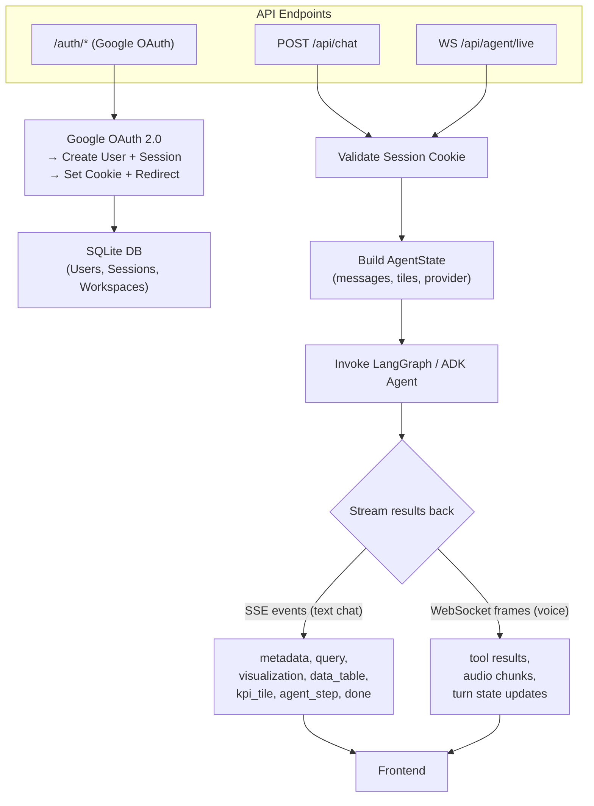

# Backend Workflow

```mermaid
flowchart TD
    subgraph Endpoints["API Endpoints"]
        ChatEndpoint["POST /api/chat"]
        LiveEndpoint["WS /api/agent/live"]
        AuthEndpoint["/auth/* (Google OAuth)"]
    end

    ChatEndpoint --> ValidateSession["Validate Session Cookie"]
    LiveEndpoint --> ValidateSession
    AuthEndpoint --> OAuthFlow["Google OAuth 2.0<br/>→ Create User + Session<br/>→ Set Cookie + Redirect"]
    OAuthFlow --> SQLite["SQLite DB<br/>(Users, Sessions, Workspaces)"]

    ValidateSession --> BuildState["Build AgentState<br/>(messages, tiles, provider)"]
    BuildState --> InvokeAgent["Invoke LangGraph / ADK Agent"]

    InvokeAgent --> StreamBack{"Stream results back"}

    StreamBack -->|"SSE events (text chat)"| SSEEvents["metadata, query,<br/>visualization, data_table,<br/>kpi_tile, agent_step, done"]

    StreamBack -->|"WebSocket frames (voice)"| WSEvents["tool results,<br/>audio chunks,<br/>turn state updates"]

    SSEEvents --> Client["Frontend"]
    WSEvents --> Client
```
