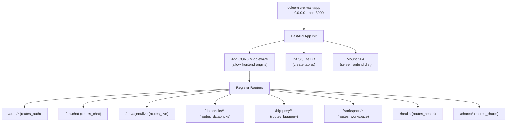
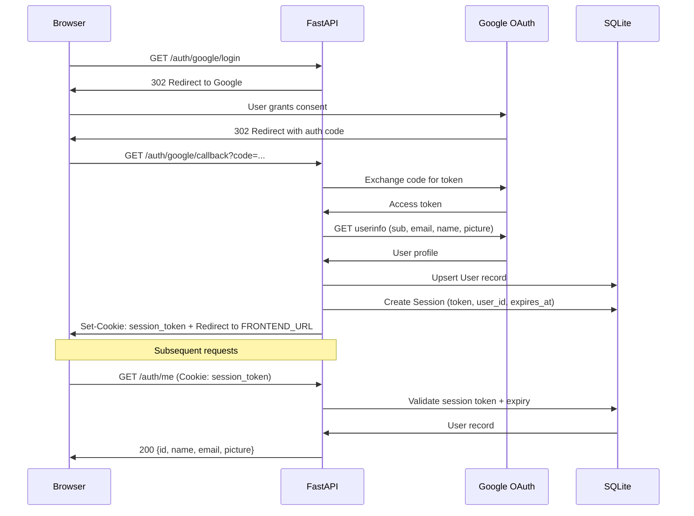
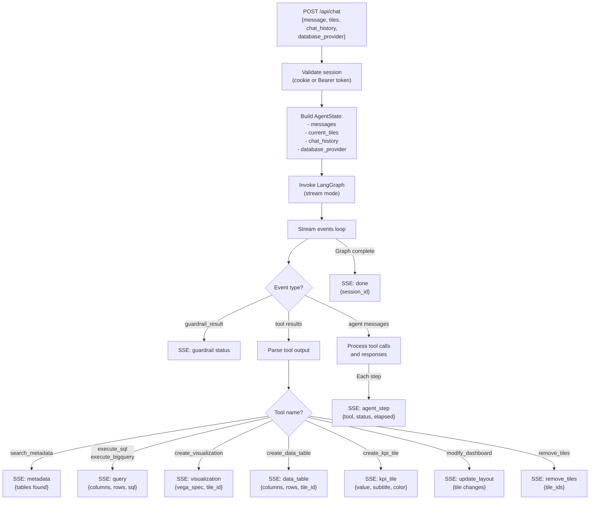
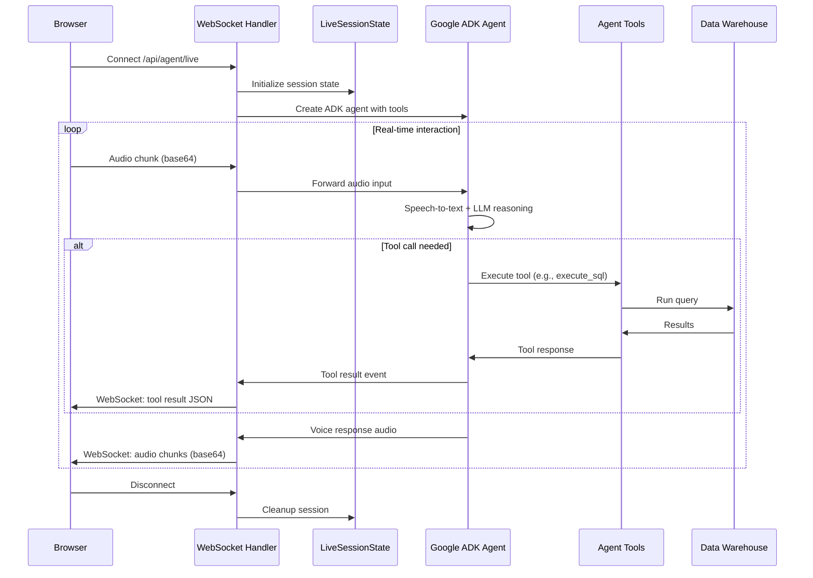
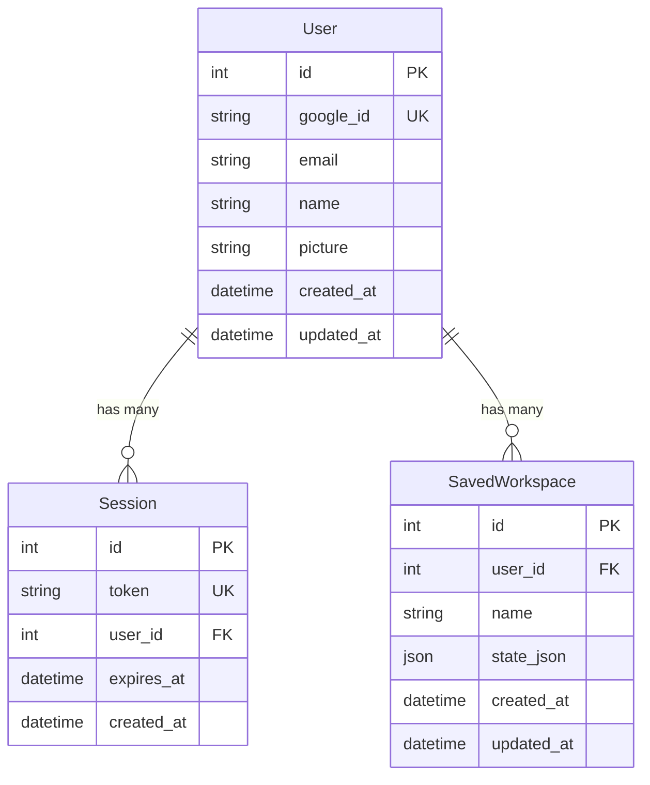

# Backend Workflow

Detailed flow of the FastAPI backend application.

## Application Startup

## Authentication Flow

## Chat API Flow (SSE)

## WebSocket Live Agent Flow

## Database Schema

## API Route Summary

| Route | Method | Protocol | Purpose |
|-------|--------|----------|---------|
| `/auth/google/login` | GET | HTTP | Initiate OAuth |
| `/auth/google/callback` | GET | HTTP | OAuth callback |
| `/auth/me` | GET | HTTP | Current user info |
| `/auth/logout` | POST | HTTP | End session |
| `/api/chat` | POST | SSE | Text chat with agent |
| `/api/agent/live` | WS | WebSocket | Voice chat with agent |
| `/databricks/status` | GET | HTTP | Connection status |
| `/databricks/reindex` | POST | HTTP | Re-index schema in Milvus |
| `/databricks/schema` | GET | HTTP | Get table schema |
| `/bigquery/status` | GET | HTTP | Connection status |
| `/workspace/save` | POST | HTTP | Save dashboard state |
| `/workspace/load` | GET | HTTP | Load saved dashboard |
| `/health` | GET | HTTP | Health check |
