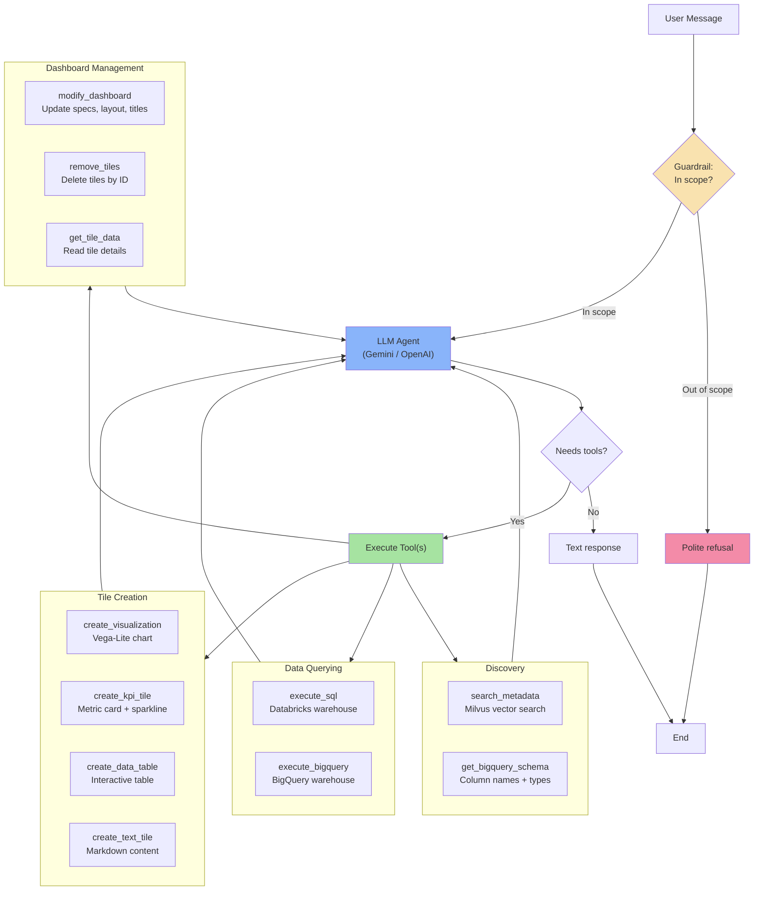

# Agentic Workflow

```mermaid
flowchart TD
    UserMsg["User Message"] --> Guardrail{"Guardrail:<br/>In scope?"}

    Guardrail -->|"Out of scope"| Refuse["Polite refusal"] --> Done["End"]
    Guardrail -->|"In scope"| Agent["LLM Agent<br/>(Gemini / OpenAI)"]

    Agent --> Decision{"Needs tools?"}
    Decision -->|"No"| TextReply["Text response"] --> Done

    Decision -->|"Yes"| ToolExec["Execute Tool(s)"]

    subgraph Discovery["Discovery"]
        SearchMeta["search_metadata<br/>Milvus vector search"]
        GetSchema["get_bigquery_schema<br/>Column names + types"]
    end

    subgraph DataQuery["Data Querying"]
        ExecSQL["execute_sql<br/>Databricks warehouse"]
        ExecBQ["execute_bigquery<br/>BigQuery warehouse"]
    end

    subgraph TileCreation["Tile Creation"]
        CreateViz["create_visualization<br/>Vega-Lite chart"]
        CreateKPI["create_kpi_tile<br/>Metric card + sparkline"]
        CreateTable["create_data_table<br/>Interactive table"]
        CreateText["create_text_tile<br/>Markdown content"]
    end

    subgraph DashMgmt["Dashboard Management"]
        Modify["modify_dashboard<br/>Update specs, layout, titles"]
        Remove["remove_tiles<br/>Delete tiles by ID"]
        GetTile["get_tile_data<br/>Read tile details"]
    end

    ToolExec --> Discovery
    ToolExec --> DataQuery
    ToolExec --> TileCreation
    ToolExec --> DashMgmt

    Discovery --> Agent
    DataQuery --> Agent
    TileCreation --> Agent
    DashMgmt --> Agent

    style Guardrail fill:#f9e2af
    style Agent fill:#89b4fa
    style ToolExec fill:#a6e3a1
    style Refuse fill:#f38ba8
```
