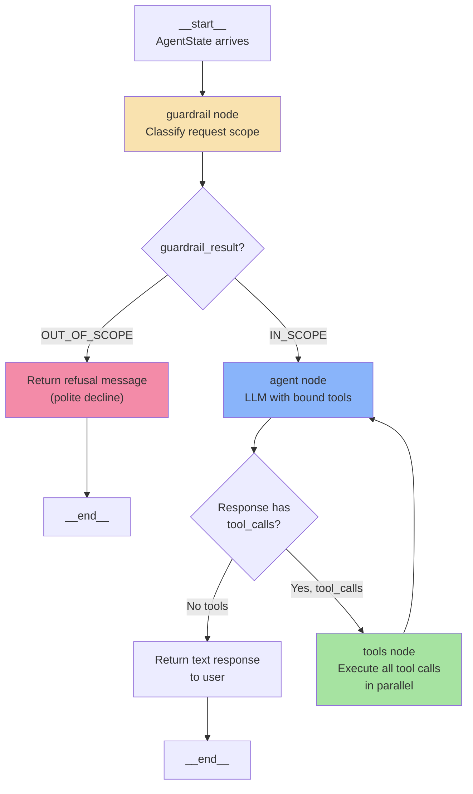
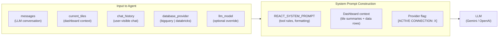
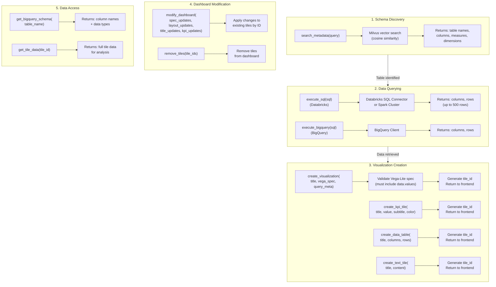
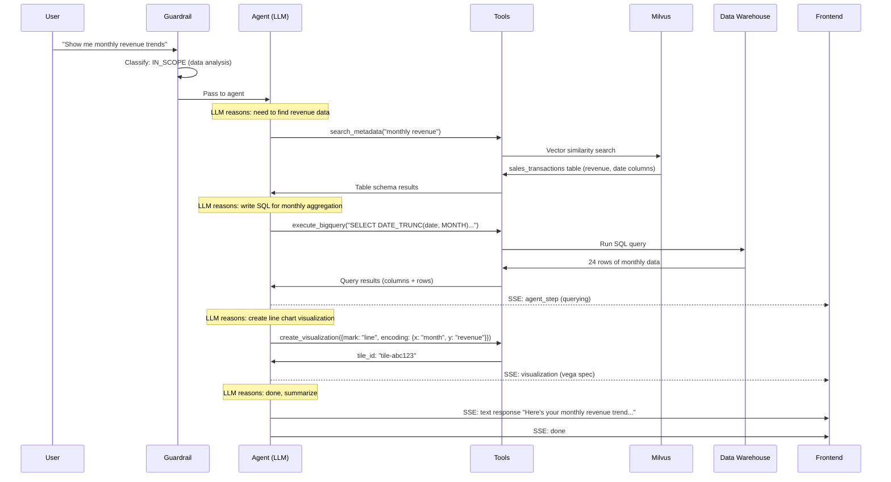
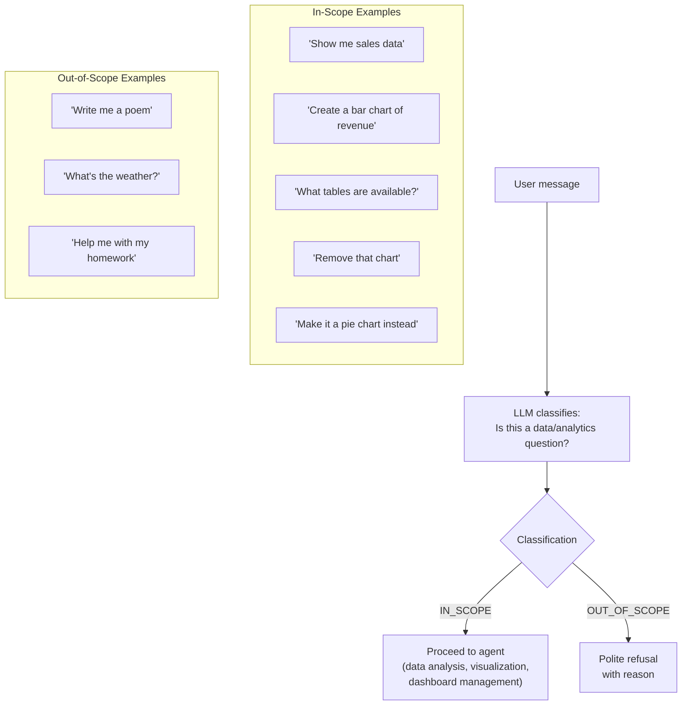
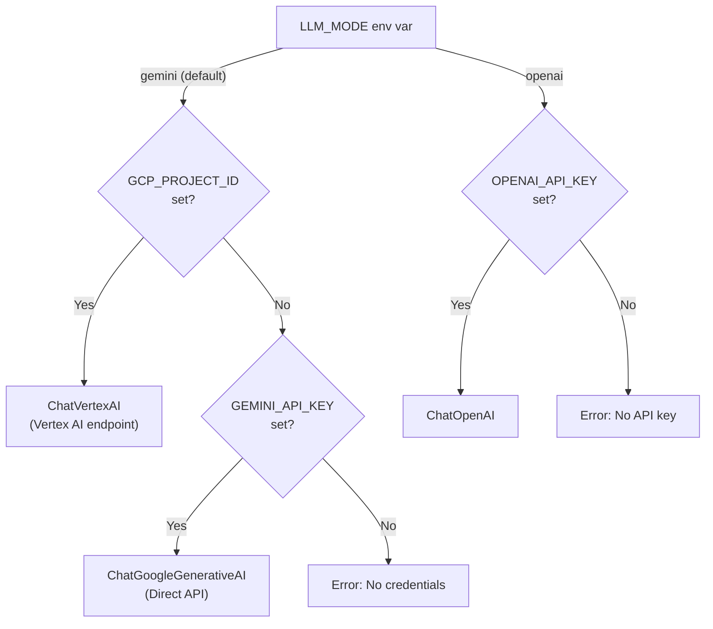
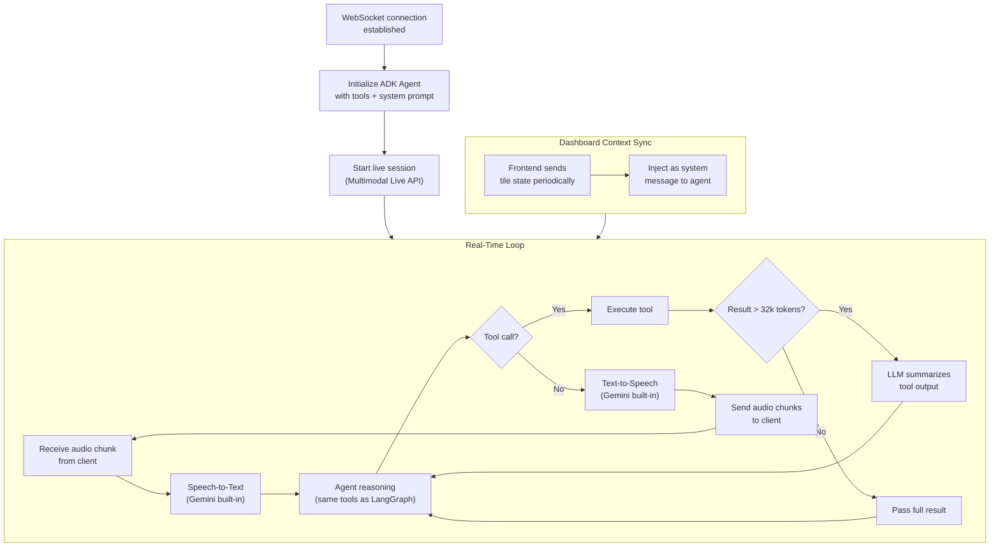

# Agentic Workflow

Detailed flow of the AI agent orchestration layer.

## LangGraph ReAct Agent Graph

## Agent State Management

## Tool Execution Flow

## Typical Agent Reasoning Chain

## Guardrail Classification

## LLM Provider Selection

## Google ADK Agent (Voice/Multimodal)

