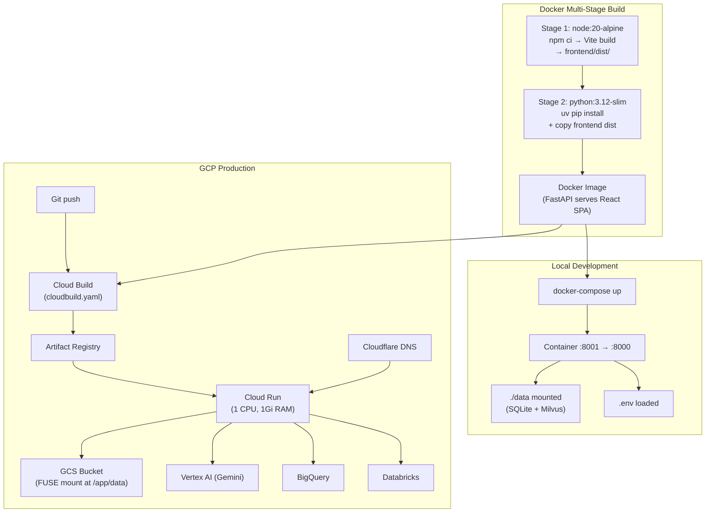

# Deployment Workflow

```mermaid
flowchart TD
    subgraph Build["Docker Multi-Stage Build"]
        FE["Stage 1: node:20-alpine<br/>npm ci → Vite build<br/>→ frontend/dist/"]
        BE["Stage 2: python:3.12-slim<br/>uv pip install<br/>+ copy frontend dist"]
        FE --> BE
        BE --> Image["Docker Image<br/>(FastAPI serves React SPA)"]
    end

    subgraph Local["Local Development"]
        Compose["docker-compose up"]
        Compose --> Container["Container :8001 → :8000"]
        Container --> Vol1["./data mounted<br/>(SQLite + Milvus)"]
        Container --> EnvFile[".env loaded"]
    end

    subgraph GCP["GCP Production"]
        Push["Git push"] --> CloudBuild["Cloud Build<br/>(cloudbuild.yaml)"]
        CloudBuild --> Registry["Artifact Registry"]
        Registry --> CloudRun["Cloud Run<br/>(1 CPU, 1Gi RAM)"]
        CloudRun --> GCS["GCS Bucket<br/>(FUSE mount at /app/data)"]
        CloudRun --> VertexAI["Vertex AI (Gemini)"]
        CloudRun --> BQ["BigQuery"]
        CloudRun --> ExtDB["Databricks"]
        Cloudflare["Cloudflare DNS"] --> CloudRun
    end

    Image --> Compose
    Image --> CloudBuild
```
