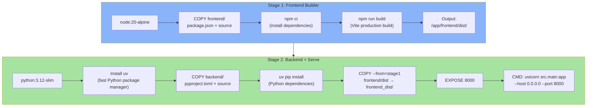
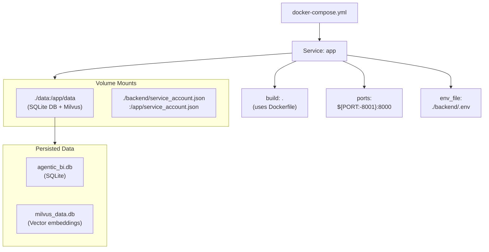
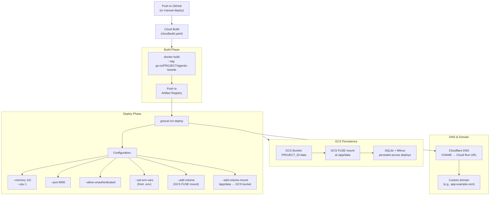
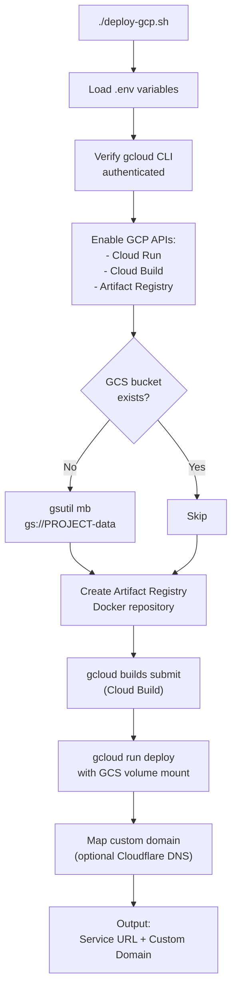
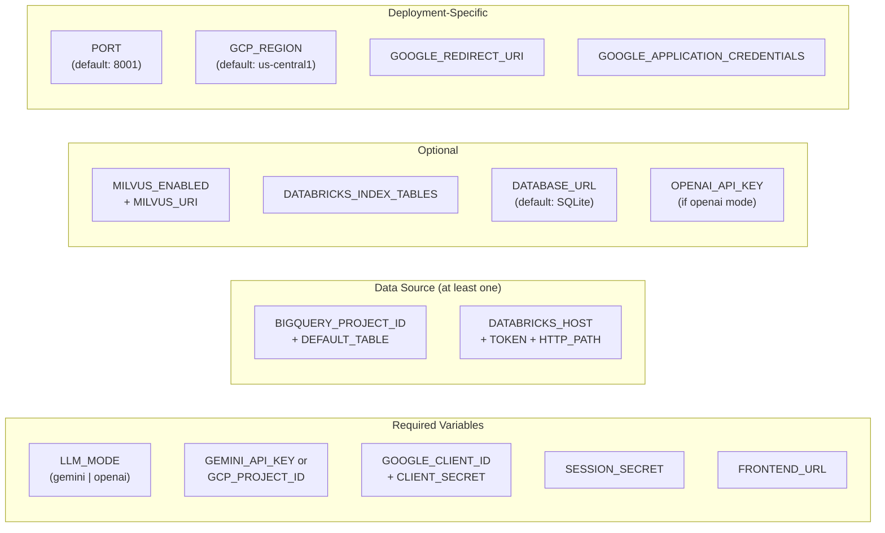
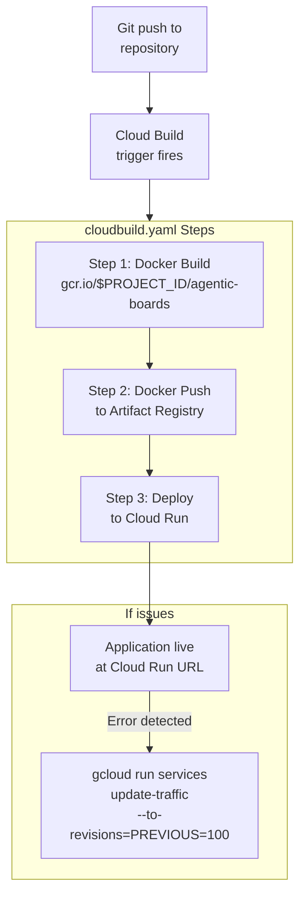
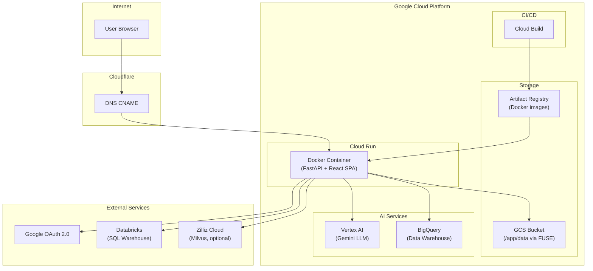

# Deployment Workflow

Detailed flow of building, containerizing, and deploying the application.

## Docker Build (Multi-Stage)

## Docker Compose (Local Development)

## GCP Cloud Run Deployment

## deploy-gcp.sh Script Flow

## Environment Configuration

## CI/CD Pipeline (Cloud Build)

## Infrastructure Diagram

